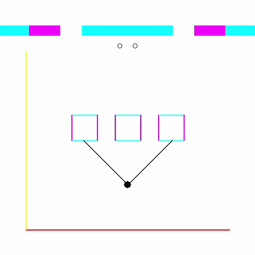
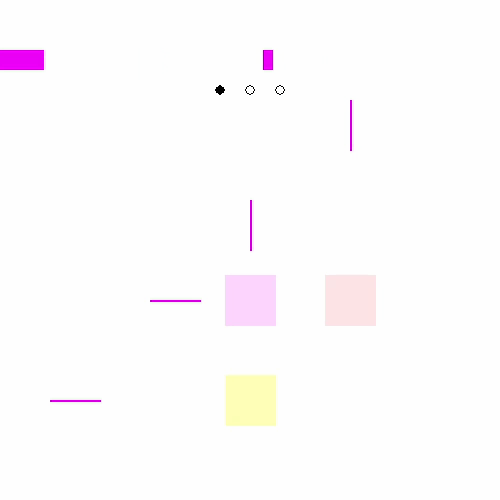

# Sightline
A minimalist puzzle game about visualizing one less dimension than we're used to.

## Notes
- Won 8th place overall in the [2019 GMTK Game Jam](https://itch.io/jam/gmtk-2019/results), out of 2589 entries
- Comes with 30 levels, each designed to with a unique challenge in mind
- Implements a raycasting algorithm to render one-dimensional vision
- Features sounds by the talented [saiziju](https://saiziju.itch.io/)

## To run this code, you'll need:
- Python 3.5+
- PyGame 1.9.4+

Run Sightline.py to start the game.

## More GIFs

### Gameplay
In the actual game, the player character is hidden. You must use your one-dimensional vision to figure out where you are on the map, so that you can drop one circle into each of the colored regions.

### Raycasting Visualization
A demonstration of the raycasting algorithm used to render the line of sight. First, a ray is drawn towards the ends of every line segment on the map. Then, those rays are swept in clockwise order, and a block of color is drawn with a width proportional to the angle between consecutive rays.

